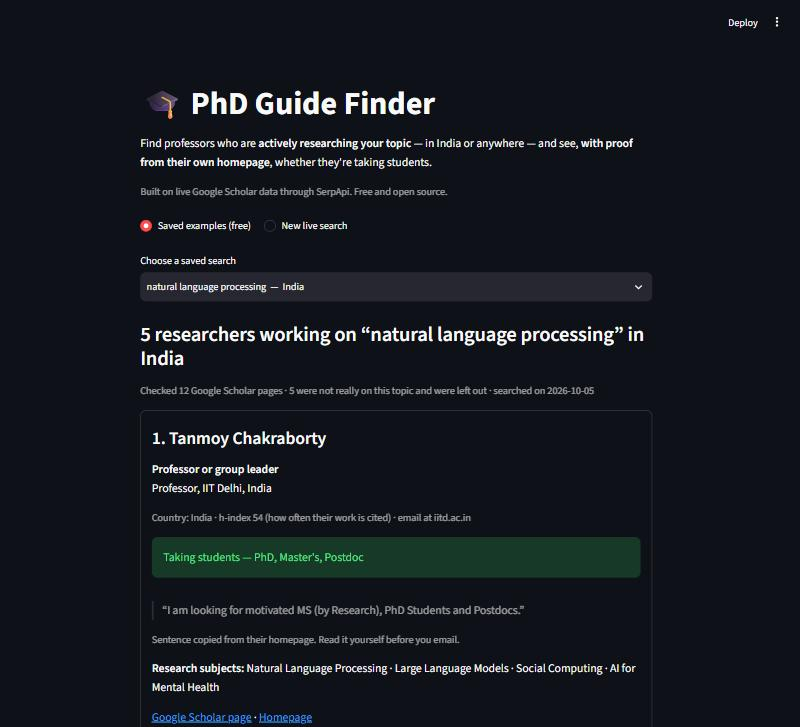

# 🎓 PhD Guide Finder

**Find professors who are actively researching your topic — in India or anywhere — and see, with proof from their own homepage, whether they are taking students.**

Built for the **SerpApi India Hackathon 2026** · Track: **Knowledge & Public Interest**



---

## The problem

"PhD admission" is one of India's most-searched education topics on Google — mostly for IITs, IISERs and central universities. The hardest first step is finding a **guide** (supervisor): a professor who works on *your* topic, is still active, and is taking students. Today students do this by hand — opening department pages one by one, reading old lab websites, emailing people who stopped working on the topic years ago. It takes days, and many email the wrong people.

Paid matching services exist, but they cost money and work from their own databases. PhD Guide Finder is free, searches live, and shows the evidence behind every suggestion.

## What PhD Guide Finder does

You type a research topic (for example *natural language processing*) and choose **Global**, **India**, or any country. In about a minute you get a ranked list of researchers, and for each one:

- their job and university, country, and h-index (how much their work is cited)
- their research subjects and **their recent papers on your topic**, with links
- **"Taking students?"** — if their homepage says so, the exact sentence is copied as proof, and labelled with what is offered (PhD, Master's, Postdoc, Internship…). An internship-only opening is shown in yellow, so a PhD seeker is not misled.
- links to their Google Scholar page and homepage
- **how they were found** (for example "works with Pheng Ann Heng")

Real example (saved in `demo/`): *natural language processing, India* found professors at IIT Delhi, IIT Bombay, IISER Kolkata, ISI Kolkata and DAIICT — two with homepage sentences such as *"I am looking for motivated MS (by Research), PhD Students and Postdocs."*

## How it uses SerpApi

SerpApi is the core of the project — without live search data there is nothing to show.

| SerpApi API | What we use it for |
|---|---|
| **Google Scholar API** (`engine=google_scholar`) | Step 1: recent, well-cited papers on the topic (filtered by year), with their authors' Scholar IDs |
| **Google Scholar Author API** (`engine=google_scholar_author`) | Steps 2 and 4: each researcher's affiliation, verified email domain, research subjects, h-index, homepage, latest papers (sorted by date), and their **co-authors** with affiliations |
| **Account API** (free) | Shows how many searches your key has left, before you search |

## How it works

1. **Find recent papers** on the topic (Google Scholar). With a country, the search adds a place hint (for example *"Indian Institute"*) so the starting papers come from that country.
2. **Open the strongest authors' Scholar pages** (weighted by how often their papers are cited).
3. **Follow co-authors.** Every Scholar page lists who the person publishes with — strong researchers work with strong researchers. The search keeps opening the most promising co-author: one who works with several people we already trust, holds a professor-type title, and (if you chose a country) works there.
4. **Check the topic with a small AI "meaning" model** (`all-MiniLM-L6-v2`, free, runs on your computer). It compares your topic with each listed subject and with recent paper titles, so *"X-ray segmentation"* counts as medical image analysis but *"sports medicine"* does not. Hand-checked on 89 researchers across two topics, it judged 88/89 and 87/89 correctly.
5. **Read their homepage** for a real sentence like *"we are looking for PhD students"* — short, mentioning who is wanted, with a message word ("looking for", "recruiting", "available"…), so website menus such as *"Prospective Students | Admissions"* are not counted.
6. **Rank** by: professor or senior researcher, says they are taking students, recent papers on the topic, and h-index. People who work at companies (who cannot usually supervise a PhD) are left out.

Every search result and homepage is saved in `cache/`, so the same search is never paid for twice.

## Quick start

You need **Python 3.10 or newer**.

```bash
git clone https://github.com/Dharanieesh7/phd-guide-finder.git
cd phd-guide-finder
pip install -r requirements.txt
streamlit run app.py
```

The page opens in your browser. **Saved examples** work straight away — no key, no searches used.

For **new live searches** you need a free SerpApi key (250 searches a month): sign up at [serpapi.com](https://serpapi.com/users/sign_up), then either

- paste it into the box on the page (it is kept only in that browser tab), **or**
- copy `.env.example` to `.env` and put your key after `SERPAPI_API_KEY=`, then check it with `python check_key.py` (this check is free).

The first live search downloads the small meaning model (about 90 MB, once).

### Command line (optional)

```bash
python finder.py "natural language processing" --country India
```

## How many searches does a search cost?

| Action | SerpApi searches |
|---|---|
| Opening a saved example | 0 |
| Searching a topic that was searched before | 0 (saved result is shown) |
| **Quick** search | about 7 |
| **Thorough** search | about 11–13 |

## Honest limitations

- **Works best where researchers use Google Scholar.** In 20 recent papers per topic, the number of authors with a Scholar page was: natural language processing 49, medical image analysis 47, renewable energy 44, constitutional law 20, English literature 9. Science, engineering, computing and medicine work well; law partly; literature and languages poorly. The page warns you when a subject looks thin.
- **Results depend on where the search starts.** Co-author networks cluster: one renewable-energy search found three professors at the same university. Try *Thorough*, a different wording of the topic, or a country.
- **Country is a best guess** from the email ending and the job text. An Indian university with a `.com` email and no place name in its title may be missed.
- **"Not mentioned" does not mean "no".** Many professors take students without saying so online — email them and ask.
- Scholar pages can be out of date, and some homepages block automatic reading. Always read the professor's own page before you email.

## Project files

| File | What it is |
|---|---|
| `app.py` | The web page (Streamlit) |
| `finder.py` | The engine: search, co-author walk, topic check, homepage check, ranking |
| `serp.py` | The only file that talks to SerpApi; saves every result in `cache/` |
| `make_demo.py` | Re-creates the saved examples in `demo/` from saved data (spends no searches) |
| `check_key.py` | Checks your SerpApi key works (free) |
| `demo/` | Saved example searches shown on the page |

## Privacy

Only public information is used: Google Scholar profiles and public homepages. Your SerpApi key is never saved by the page and never shown in messages. `.env` and `cache/` are not uploaded to GitHub.

## Credits

Built by Dharanieesh M D for the SerpApi India Hackathon 2026. Developed with help from Claude (Anthropic) as a coding assistant.
